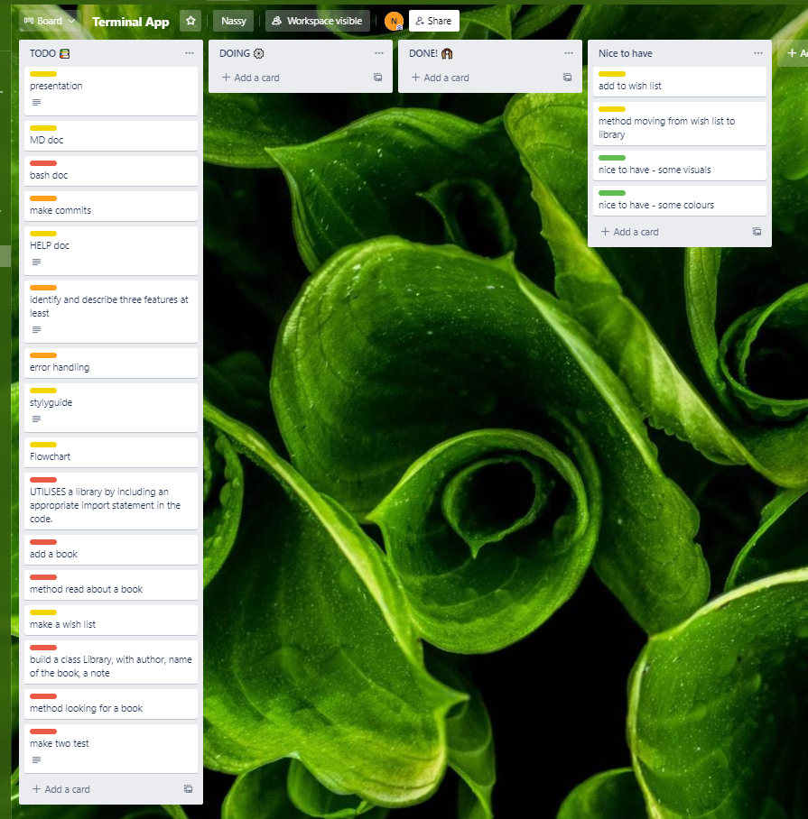
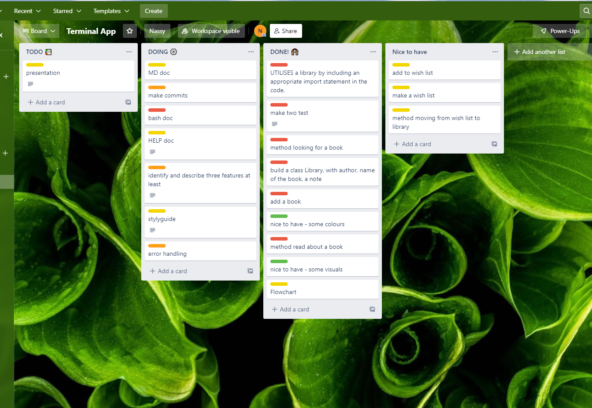
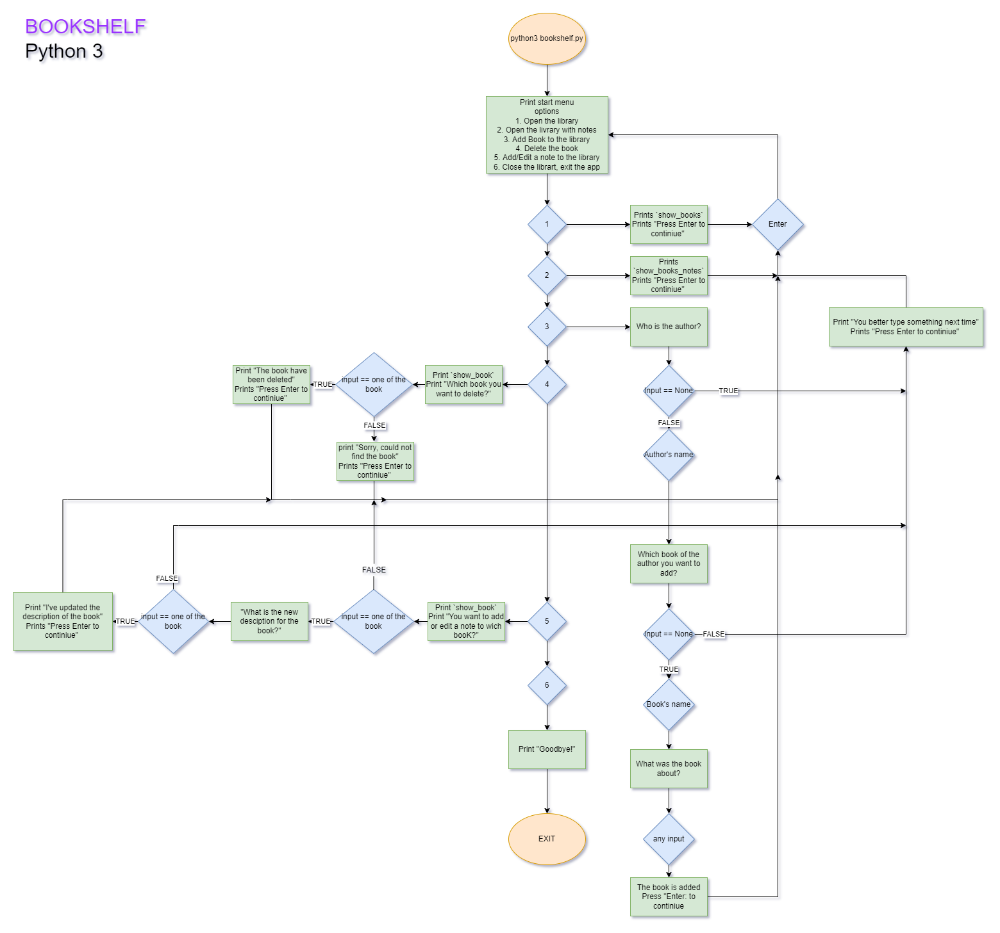

# Bookshelf, a plase to store memories about the books

Bookshelf is an app that let add books you read and add notes to the books.

## System Requrements
Bookshelf uses Python 3.8.10

## Installation and Execution

Clone this repo to your local machine:

`$ clone https://github.com/purplebus/Bookshelf.git`

Move to code folder

`cd src`

Run the script

`$ ./run_bookshelf.sh`

To run the app use

`python3 bookshelf.py`

## Idea
Since I was little, I was reading books non-stop. Books became my oasis, my friends, my escape. My library was taken up all bookshelfs at my parent's place. Wjen I moved to Australia, I brought about 30 books with me, because you can't let friends go! 
These days I mostly read books on Kindle. With time I realized tat I can't remember what was the book about based only on the name of the book. I tried to use a book diery, a book Instagramm page, nothing worked. With this app, I can add the books I've read and add a note that will help me to remember what was the book about.

## Features

### Library
Bookshelf has a library with some books I have already read. It usues `Class Book` with values for Author's name, Book's name and a note for the book. Library using method `_print_library` to list the books that are in the library. From the main menu option "1" will show the library with Authors and Book's names. Option "2" will show notes as well as othet information.

### Add a book to the library
A book can be added via main menu using option "3". The app will ask to add Author's name and a book's name. If the input will be empty (No imput), the app will inform about it and return to the main menu. Note can be added when adding the book or later using option "5' in the main menu. Method `_add_item` and `_edit_item_note` are used.

### Delete the book
For any reason, the book can be deleted from the library using option "4" in the main menu and method `_delete_item`

## Testing
Two manual tests had been performed, they can be found [here](docs/Manual_Test.xlsx).
First test was design to test the start menu
Second test was designed to test feature "add the book"

## Error handling
For adding a new book and an author, if any of inputs is empty, the app will respond
```python
    if name == "":
        return print("You better type something next time")
```

##  Developer tools to facilitate the execution of the application
Trello board in the beginning


Trello Board closer to the end




## Flow Chart



## Challenges
Due to the timelimit, have been decided to cut out the feature "Wish List".
Adding the colors expected to be a difficlut task, but ended up being done